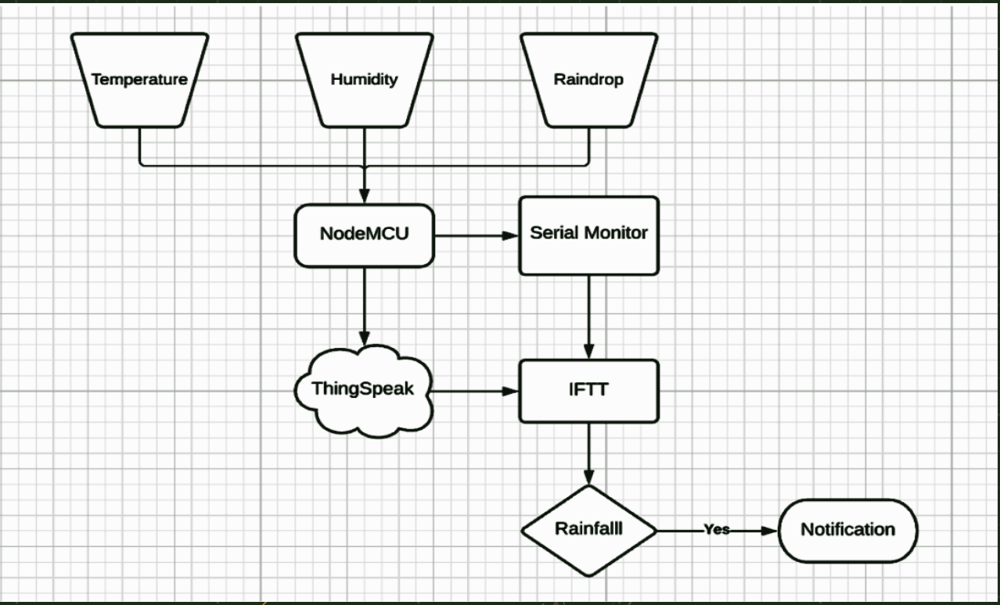

# Weather-Montoring-Station

- The weather station will be used to determine 3 parameters namely temperature and humidity using the DHT11 and rain condition using the KG004 rain drop sensor. NodeMCU will be used to interface the sensors and the WIFI module embedded inside the NodeMCU helps in connecting with the ThingSpeak cloud
- Temperature & Humidity will be detected by DHT11 sensor and rain value will be detected by KG004. The collected data is then sent to the system via NodeMCU. NodeMCU sends the data to Think Speak cloud which will graphically represent the data for the analysis.

## FLowChart
